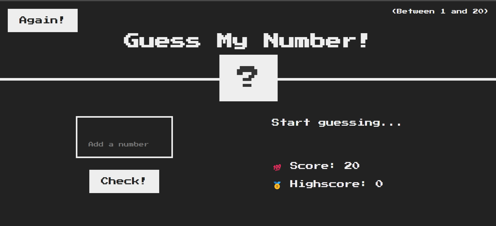

# Guess-My-Number

## Table of contents

- [Overview](#overview)
- [The challenge](#the-challenge)
- [Links](#links)
- [Screenshot](#screenshot)
- [My process](#my-process)
- [Built with](#built-with)
- [What I learned](#what-i-learned)
- [Continued development](#continued-development)
- [Useful resources](#useful-resources)
- [Author](#author)
- [Acknowledgments](#acknowledgments)

## Overview

In this project is about guessing the random number givin by the program itself. So the user can add a number and the program verify if the number is the same number as the program presented. Also the program show if the number given by the user is to high or to low, the highscore and score is also presented .

### The challenge

Users should be able to:

- Should
- Add every number between 1 and 20
- Check if if the correct number
- See in the real time the score and highscore.
  -Can check the project on different types of devices.

# LINK
[CLICK ME FOR LIVE VIEW] [https://miron-silviu.github.io/Guess-My-Number/]

## Screenshot



## My Process

My process building this project start with the already given boilerplate template from the course. In the first instance I start to define new variables in script.js and I implemented a logic to check if score > highscore, after that I implemented another logic to check if guess !== secretNumber, all this logics are stored inside the eventListener for Check button. For the AGAIN button the logic is to reset the game .

## Built With

- Semantic HTML5 markup
- CSS custom properties
- Flexbox
- Mobile-first workflow

## What I Learned

I learned how to add click event and also everything from that event goes inside of it .

```css
.proud-of-this-css {
  main {
    display: flex;
    flex-direction: column-reverse;
    margin: auto;
    margin-left: 2rem;
  }
}
```

```js
const displayMessage = function (message) {
  document.querySelector('.message').textContent = message;
};
};
```

\*\*


## Useful Resources

- [Example resource 1](https://www.udemy.com/course/the-complete-javascript-course/learn/lecture/22648403#overview) - This helped me for building the project.

## Author

- Website - [Add your name here](https://www.your-site.com)
- Frontend Mentor - [@yourusername](https://www.frontendmentor.io/profile/yourusername)
- Twitter - [@yourusername](https://www.twitter.com/yourusername)
